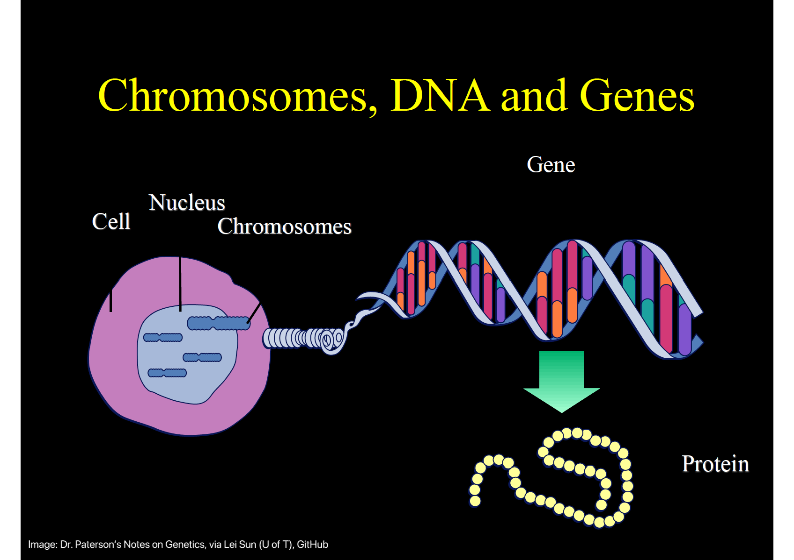
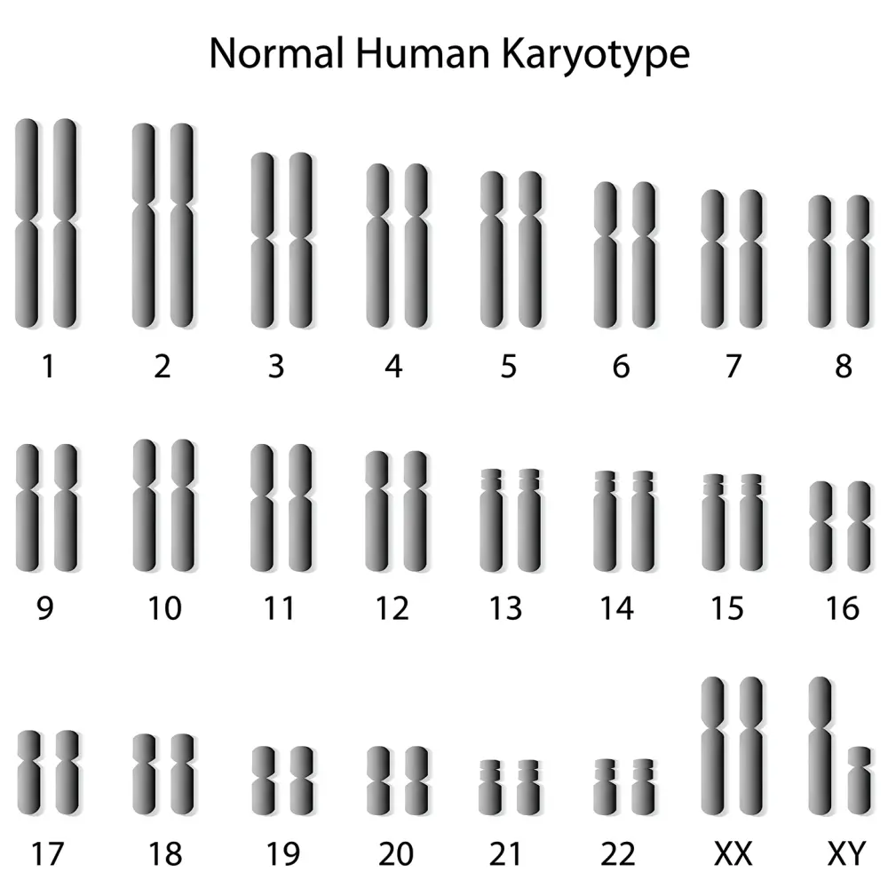
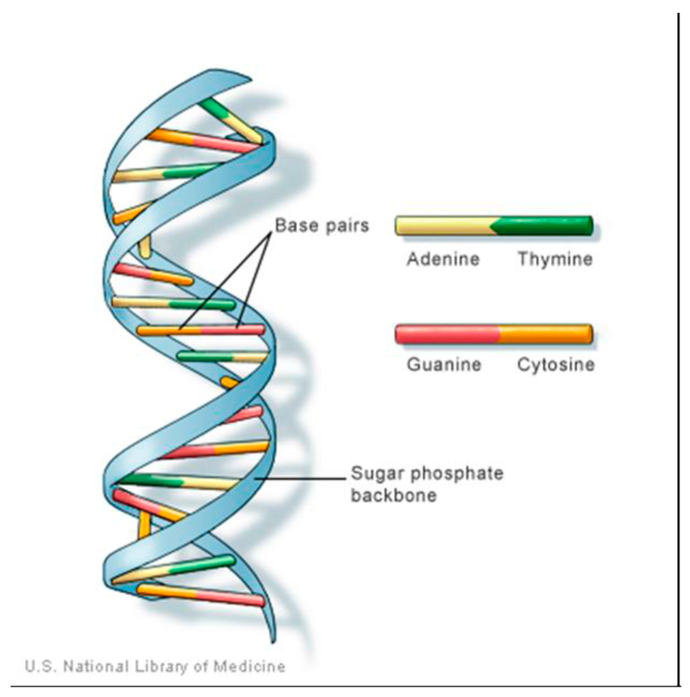
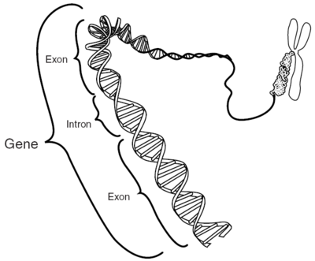

# Fundamentals of Statistical Genetics

```
$ echo "Data Sciences Institute"
```

---

# Introduction

## $\rightarrow$ **What is Statistical Genetics and Genomics?**


<p align="center" style="font-size:14px;">
  <strong>Big Data:</strong> <em>n &gt; 10<sup>3</sup>, p &gt; 10<sup>6</sup></em> (high-level processed data in GB and ‘raw data’ in TB) and<br>
  <strong>Complex:</strong> (e.g. multiple causal factors, interactions, pathway/network…)
</p>

---

# Welcome / Course Content

---

# Course Content

- Background in molecular genetics and basic genetic models
- Population genetics & consequences on genetic association studies
- Heritability estimation
- Basics of disease gene mapping: association tests
- Genome-wide association studies (GWAS) 
  - quality control
  - genotype imputation
  - multiple testing
  - meta-analyses 
  - population substructure   
---

# GitHub Repo

[https://github.com/UofT-DSI/sql](https://github.com/UofT-DSI/stat_gen)

- Schedule
- These slides (HTML & PDF)
- Our database for live coding
- All in-class code
- Assignment details and rubrics
- Policies, due dates, etc

---

# Course Content

<!--
- This course is an _Introduction_ to Statistical Genetics
-->

- At the end of the course, I hope you will:
  - Understand and apply core genetic principles
  - Conduct and interpret population genetic analyses
  - Perform genome-wide association studies (GWAS)

- We won't cover advanced topics like:
  - Polygenic risk score
  - Integration of multi-omics data
  - Whole-genome sequencing studies

---


# Assignments

- Two assignments, released on Monday of each week.
- Broken into three sections:
  - Section 1 focuses on review of molecular genetics and basic genetic models
  - Section 2 focuses on population genetics & consequences on genetic association studies
  - Section 3 focuses on Genome-wide association studies
- Review questions/answers in Office Hours course support

---


# Grading 

- Pass/Fail. Do the work, pass the course :) 

- Assignment 1: 30% of mark
- Assignment 2: 70% of mark
- Review rubrics for full details

- Class Attendance: *not graded this cohort, come anyways!*
  - Let myself or course support know if you are unable to attend a lesson
  - Code along!! Best way to learn.
---


### What questions do you have about the course?

---

# What is Statistical Genetics?

- Statistical genetics is an interdisciplinary field at the interface between statistics and genetics and is concerned with the development of statistical methods for problems in genetics.
- Genetics is a subfield of biology concerned with the study of heredity (transmission of genetic material from parents to offspring) and genetic variation.

---



---

 # Chromosomes 

- 23 pairs of chromosomes: 22 homologous pairs (Autosomes) and 1 pair of sex chromosomes (XX female, XY male).
- Where genetic material is stored and in the nucleus of every cell.
- Numbered in order of decreasing length from 1 to 22.
- Karyotype is a microcopic examination of choromosme size and banding patterns.

---

 # DeoxyriboNucleic Acid (DNA) 

- Each chromosome has a double helix structure: two long strands of DNA, bounded to each other lengthwise. 
- DNA is the basic biological material of inheritance; it determines how proteins are manufactured in the body.
- Each strand of DNA is a long molecule made up of a linear sequence of subunits/base
pairs: ATGC.
- ‘Size’ of the genome: ≈ 3 billions of DNA
base pairs
- A-T and G-C matching: information on one strand is sufficient.


---
<!--
 # DeoxyriboNucleic Acid (DNA) 
Might add an additional slides on double helix Structure coding
----
-->

# Human Genome
- 3 billion nucleotides (A,C,G,T) in the whole human genome.
  – Paired, double helix
- About 3 million of them differ between people (0.1% difference) - Genetic Variations.
- Most of these variations are in ‘junk DNA’.
  - Not directly code for proteins.
  - May have regulatory or unknown functions.
- Minority of these variations change how products of genes (proteins) behave.
- Scientists study which variations are linked to specific traits or diseases.

---

# Genes 
- A gene is an ordered sequence of nucleotides located in a particular position on a particular chromosome that encodes a specific functional product (a protein or RNA molecule).
- About 20,000 - 30,000 genes throughout the genome.
- Gene sizes vary from about 1K DNA base pairs to more than 1 million bp.
- Consists of several coding segments (Exons), separated by non-coding sequences (Introns)
- Introns do not code for specific proteins, BUT, they are not junk and may regulate exons.


---

## Finding a gene is like finding the correct address of a house in Canada
- Chromosomes are like Provinces
- Bands on chromosomes are like Cities and Towns
- Genes are like Streets
- Positions in genes are like individual houses
  
How do we find the right address?

---

# Mutations 

- Mutations are **changes in DNA**.


--

# Effects of mutations 
- Sometimes harmless:
  - e.g., TCT and TCA both code for the same amino acid (protein building block), so changing one to the other has no impact.

- Sometimes harmful:
  - May cause proteins to malfunction.
  - cells rely on the proteins may not function properly.

---


# Genetic Markers/Polymorphism

- A **polymorphism** is a part of DNA that can differ between individuals.
- These variations come from mutations that happened over long periods of human history.
- The different versions (or "states") of a polymorphism are called **alleles**.
- In statistical term: a polymorphism is a random variable and an allele is one of the outcomes in the sample space.


---

# Types of Genetic Markers/Polymorphism
  - A **(bi-Allelic) single nucleotide polymorphism (SNP)** is a type of genetic variation where a single nucleotide (A, C, G, or T) differs between individuals.
  - An **allele** at a SNP refers to one of the possible nucleotide bases — A, C, G, or T.
  - Most SNPs are bi-allelic, meaning the two alleles can be either G-C or A-T (matching).
  - Could code them A (say for G-C) and a (for A-T).
  - Simplest: just a one-base difference between individuals.
  - Appear about every 300 base pairs.
  - ≈ 10 million SNPs.


---

# Types of Genetic Variants

- **Variable number of tandem repeats (VNTR)**: pecific DNA sequences that are repeated immediately adjacent to each other a variable number of times.
  - Microsatellites consist of small sequences (1-6) which are repeated.
  - The number of repeats can vary widely from one person to the next, therefore they are used often in forensic DNA and paternity testing, and in linkage mapping.
    
- **Indels**: extra base pairs (between 1 and 1000) can be inserted/deleted in between two specific base pairs
- **Structural variants**: duplications, deletions, inversions, translocations
- **CNV (copy number variants)**: large insertions/ deletions

---

## Alleles and Genotypes

**Genotype**: the two alleles at each chromosomal location (a prair of chormosome) for a given individual.
  
- e.g. a marker with two alleles denoted as A and a has 3 possible (unordered)
- genotype: AA, Aa/aA, aa.
- **Homozygous** genotype: same allelic type (AA or aa);
- **Heterozygous** genotype: different allelic type (Aa/aA).

---
# Recap

- Human genomes and **paired** chromosomes
- DNA and double helix structure (strand issue; not the same as paired chromosomes)
- A complex language from a simple 4-letter (A-T, G-C) system.

- Variations/Mutations
  - polymorphisms/genetic markers ≡ discrete random variables
  - alleles ≡ outcomes of a random variable
  - **SNP** ≡ a r.v. with two outcomes
  - Microsatellite ≡ a random variable with typically 3-30 outcomes
    
- **Genotype** data of a polymorphism/genetic marker: paired alleles (from the
paired chromosomes.

---

## Characteristics of Genetic Markers

**Population frequency**: genotype and allele frequencies
- For a given population, different genotypes and alleles 


---

# What's next
- Some Basic Concepts from Population Genetics
- Review of Some Basic Concepts from Statistical inference
---

### What questions do you have about anything from today?


