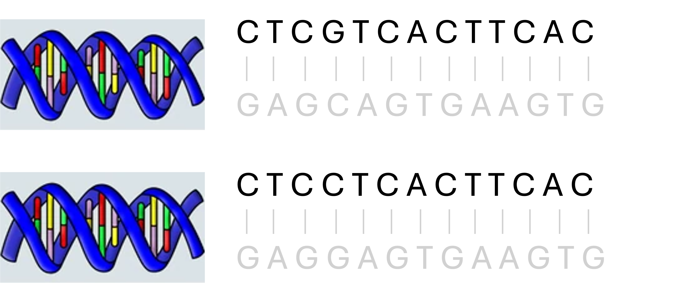
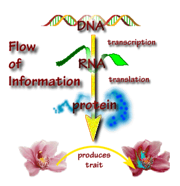

# Introduction to Statistical Genetics

```
$ echo "Data Sciences Institute"
```

---

# Introduction

## $\rightarrow$ **What is Statistical Genetics and Genomics?**


<p align="center" style="font-size:14px;">
  <strong>Big Data:</strong> <em>n &gt; 10<sup>3</sup>, p &gt; 10<sup>6</sup></em> (high-level processed data in GB and raw data in TB)<br>
  <strong>Complex:</strong> (e.g. multiple causal factors, interactions, pathway/network…)
</p>

---
# Learning Objectives

- This course provides an INTRODUCTION to concepts and fundamentals in statistical genetics.
- At the end of the course, I hope you will:
  - Understand foundational principles of population genetics.
  - Learn statistical methods commonly used in genetic data analysis.
  - Understand and apply computational and statistical methods used in the design and analysis of genome-wide studies (GWAS).
  
---

# Course Content

- Background in molecular genetics and basic genetic models
- Concepts from population genetics
- Principles of inheritance
- Aggregation, heritability and segregation analysis
- Genome-wide association studies (GWAS) 
  - Quality control
  - Genotype imputation
  - Multiple testing
  - Meta-analyses  
  - Population stratification adjustment
  
---

# Background Needed

- Pre-reqs: [Unix Shell module](https://github.com/UofT-DSI/shell) and [R module](https://github.com/UofT-DSI/r).
 
- Assume no formal training in genetics.
  - Basic concepts in molecular genetics will be introduced in the class.
- Familiarity with key concepts in statistical inference, including:
  - Elementary probability and statistical methods
  - Distributions of basic random variables (e.g., binomial, normal)
  - Likelihood-based methods: estimation and hypothesis testing
  - Basic regression techniques (e.g., linear, logistic)

---

# GitHub Repo

[https://github.com/UofT-DSI/stat_gen](https://github.com/UofT-DSI/stat_gen)

- Schedule
- These slides (HTML & PDF)
- Our database for live coding
- All in-class code
- Assignment details and rubrics
- Policies, due dates, etc

---

# Useful Online Resources

- **Textbook**: *The Fundamentals of Modern Statistical Genetics* (Nan Laird & Christoph Lange).

- **Introductory Genomics Videos**: [BigBio YouTube Channel – Genomics Playlists](https://www.youtube.com/c/BigBiovideos/playlists?app=desktop)

- **Biomedical Data Resource Guide**: [StatsUpAI – Curated Biomedical Datasets](https://statsupai.org/datasets.html)


---


# Assignments

- Three assignments (TBA), released on Monday of each week.
- Broken into three sections:
  - Section 1 focuses on review of molecular genetics and basic genetic models
  - Section 2 focuses on population genetics & consequences on genetic association studies
  - Section 3 focuses on Genome-wide association studies
- Review questions/answers in Office Hours course support

---


# Grading 

- Pass/Fail. Do the work, pass the course :) 

- Assignment 1: TBA
- Assignment 2: TBA
- Assignment 3: TBA
- Review rubrics for full details

- Class Attendance: *not graded this cohort, come anyways!*
  - Let myself or course support know if you are unable to attend a lesson
  
---


### What questions do you have about the course?

---

# What is Statistical Genetics?

- Statistical genetics is an interdisciplinary field at the interface between statistics and genetics and is concerned with the development of statistical methods for problems in genetics.
- Genetics is a subfield of biology concerned with the study of heredity (transmission of genetic material from parents to offspring) and genetic variation.

---


---
 # DeoxyriboNucleic Acid (DNA) 
 
- DNA is the basic biological material of interitance; it determines how proteins are manufactured in the body
- Each strand of DNA is a long molecule made up of a linear sequence of subunits/base
pairs: ATGC.
- A-T and G-C matching: information on one strand is sufficient.
- ‘Size’ of the genome: ≈ 3 billions of DNA base pairs


---

 # DeoxyriboNucleic Acid (DNA) 
  

___

 # Chromosomes 
 
- Each chromosome has a double helix structure: two long strands of DNA, bounded to each other lengthwise. 
- 23 pairs of chromosomes: 22 homologous pairs (Autosomes) and 1 pair of sex chromosomes (XX female, XY male).
- In each pair, one copy is inherited from the mother and one from the father.
- Where genetic material is stored and in the nucleus of every cell.

---

 # Double Helix Structure


- Each chromosome has two long strands of DNA.
- **Homologous chromosome pair**:

     
 
---

 # Double Helix Structure
 
- Each chromosome has two long strands of DNA.
- **Homologous chromosome pair**:

     
 

---

# Human Genome
- 3 billion nucleotides (A,C,G,T) in the whole human genome.
  – Paired, double helix
- About 3 million of them differ between people (0.1% difference) - Genetic Variations.
- Most of these variations are in ‘junk DNA’.
  - Not directly code for proteins.
  - May have regulatory or unknown functions.
- Minority of these variations change how products of genes (proteins) behave.
- Scientists study which variations are linked to specific traits or diseases.

---

# Mutations 

- Mutations are **changes in DNA**.

  

---

# Effects of mutations 

- Mutations can be very detrimental to an organism.
  - May cause proteins to malfunction.
  - cells rely on the proteins may not function properly.
  
- Most of these deleterious mutations remain rare in the population, because they are rarely transmitted to the next generation.

- Many of the mutations have no effect.
  - e.g., TCT and TCA both code for the same amino acid (protein building block), so changing one to the other has no impact.


---

# Mutations give rise to genetic variants

  

---

# Genetic variants/Polymorphism

- A **polymorphism** is a part of DNA that can differ between individuals.
- These variations come from mutations that happened over long periods of human history.
- The different versions (or "states") of a polymorphism are called **alleles**.
- In statistical term: a polymorphism is a random variable and an allele is one of the outcomes in the sample space.


---

# Types of genetic variants

- A **single nucleotide polymorphism (SNP)** is a type of genetic variation where a single nucleotide (A, C, G, or T) differs between individuals.
  - An **allele** at a SNP refers to one of the possible nucleotide bases — A, C, G, or T.

  - Appear about every 300 base pairs $\rightarrow$ ≈ 10 million SNPs.
  
    

---

# Types of Genetic Variants

- **Variable number of tandem repeats (VNTR)**: Specific DNA sequences that are repeated immediately adjacent to each other a variable number of times.
  - e.g. 16, 14 and 11 repeats of CA.
  - **Microsatellites** consist of small sequences (1-6) which are repeated.
  - The number of repeats can vary widely from one person to the next, therefore they are used often in forensic DNA and paternity testing, and in linkage mapping.
- **Indels**: extra base pairs (between 1 and 1000) can be inserted/deleted in between two specific base pairs
- **Structural variants**: duplications, deletions, inversions, translocations
- **CNV (copy number variants)**: large insertions/ deletions


---

# Types of Genetic Variants


---


# Genes 
- A gene is an ordered sequence of nucleotides located in a particular position on a particular chromosome that **encodes a specific functional product** (a protein or RNA molecule).
- A gene is a segment of DNA consists of several coding segments (**Exons**), separated by non-coding sequences (**Introns**)
- Introns do not code for specific proteins, BUT, they are not junk and may regulate exons.


---
# Genes 
- **Gene sizes vary** from about 1K DNA base pairs to more than 1 million bp.
- About **20,000 - 30,000 genes** throughout the genome.
- Genes themselves do not directly affect traits.
- Proteins - the coded product of genes - are the ones influencing traits.
- Through the processes of **transcription** and **translation**, information from genes is used to make proteins. 


---

# Proteins

- Proteins are strings of amino acids.
- There are **20 different amino acids** that are coded by codons.
- A **codon** is a sequence of **3 letters** (nucleotides) in DNA or RNA.
- There are 64 possible codons (4 bases: A, T, C, G — and combinations of 3)
- Multiple codons can code for the same amino acid.
  - For example: TCT and TCA both code for Serine.
  - This redundancy helps protect against mutations.

---

# Codon Change Causes Sickle Cell Trait

- A Variant in the Hemoglobin Gene Causing Sickle Cell Anemia

     
 

---

# Alleles and Genotypes

**Genotype**: the two alleles at each chromosomal location (a pair of chormosome) for a given individual.
  
- Most SNPs are bi-allelic; two alleles can be either G-C or A-T (matching).
- Could code them A (say for G-C) and a (for A-T).


---

# Alleles and Genotypes

- A SNP with two alleles (A and a) has 3 possible (unordered) genotype: AA, Aa/aA, aa.
- **Homozygous** genotype: same allelic type (AA or aa);
- **Heterozygous** genotype: different allelic type (Aa/aA).

    

---
# Recap

- Human genomes and **paired** chromosomes
- DNA has double helix structure: a 4-letter (A-T, G-C) system.
- Variations/Mutations
  - polymorphisms/genetic variants ≡ discrete random variables
  - alleles ≡ outcomes of a random variable
  - **SNP** ≡ a r.v. with two outcomes
  - Microsatellite ≡ a random variable with typically 3-30 outcomes
    
- **Genotype** data of a polymorphism/genetic variant: paired alleles (from the
paired chromosomes.

---

# What's next
- Fundamental principles of population genetics
- Basic genetic models and genotype coding frameworks
- Principles of inheritance


### What questions do you have about anything from today?


